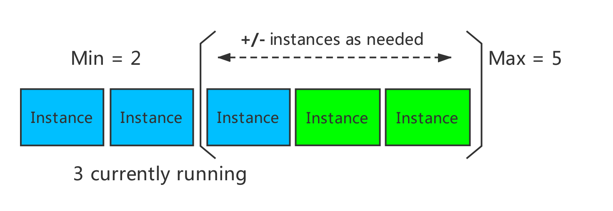
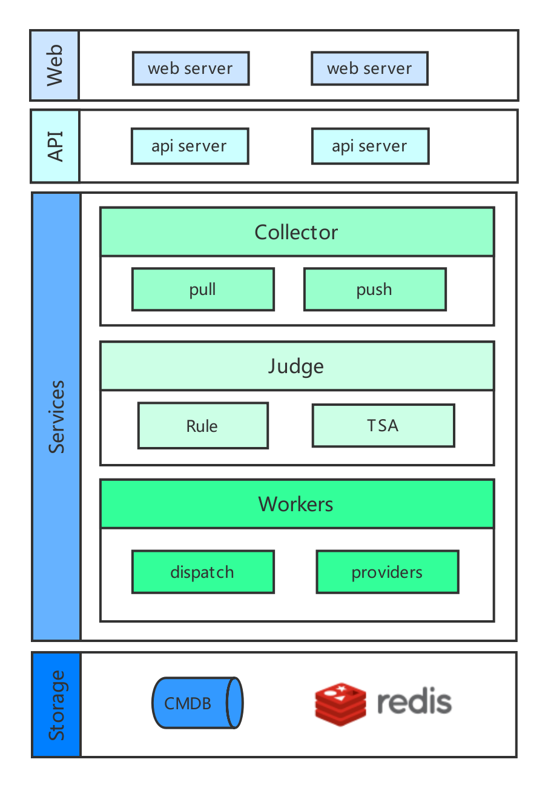

# AutoScale

## Introduction
AutoScale is a robust approach to backend infrastructure that attempts to scale
up resources when your application is high, while also save money by scale down
resources that are sitting idle.

Specify a minimum and maximun number of instances of run and add or remove
instances automatically based on a set of rules. Having a minimum makes sure
your application is always running even under no load. Having a maximum limits your
total possible hourly cost. You automatically scale between these two extremes
using rules you create.

<div>  </div><br>

## Architecture

<div>  </div><br>

- WebServer - A graphical user interface to help users manage rules
- ApiServer - Api Backend
- Collector - Collect time series data，push and pull supports
- Judge
    - Rule Definitions
    - TSA - Time Series Analysis
- Workers
    - Dispatch - Scale out or Scale in
    - Providers - External providers
    - Audit - Log and Audit history is pushed to database for storage (CMDB)
- Storage - Provide cache and storage resources


## Algorithm Details


```
desiredInstances = ceil(currentInstances * ( currentMetricValue / desiredMetricValue ))
```

### Scale Out

```
desiredInstances > currentInstances
```

**Notes**: The `desiredInstances` must be less than or equal to the maximum that definition on the rules

### Scale In

```
desiredInstances < currentInstances
```

**Notes**: The `desiredInstances` must be greate than or equal to the minimum that definition on the rules


For Example, if the current metric value is `60`, and the desired value is `30`,
the number of instances will be doubled, since `60.0 / 30.0 == 2.0` if the
current value is instead `15`, we'll halve the number of instances, since `15.0
/ 30.0 == 0.5`. We'll skip scaling if the ratio is sufficiently close to 1.0


## RoadMap

- Predictive Auto Scaling
